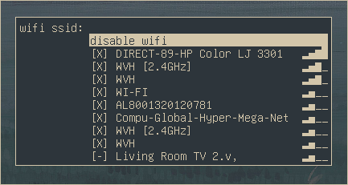

# tofi-wifi-menu

a wi-Fi menu written in bash. Uses tofi and nmcli. forked from [ericmurphyxyz](https://github.com/ericmurphyxyz/rofi-wifi-menu) who forked from [zbaylin](https://github.com/zbaylin/rofi-wifi-menu) because it was unmaintained and incompatible with modern versions of rofi (which also meant that they simplified a bunch of other code for me). additional contributions from [vlfldr](https://github.com/vlfldr/rofi-wifi-menu)'s fork.



### installation

install `nmcli` and `tofi` with your package manager (or manually if tofi is not in your package manager). then run the following commands:

```
git clone https://github.com/uuupah/tofi-wifi-menu.git
cd tofi-wifi-menu
bash "./tofi-wifi-menu.sh"
```

you'll probably want to put the script in your `$PATH` so you can run it as a command and map a keybinding to it.

### todo

- [ ] provide an example config to recreate the example screenshot
